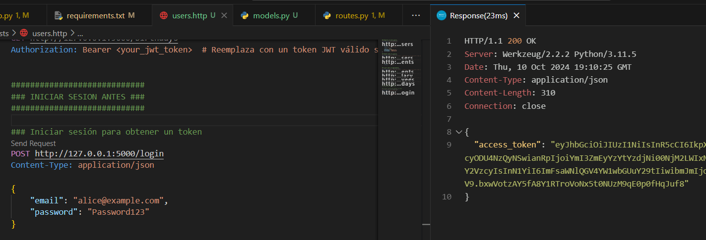
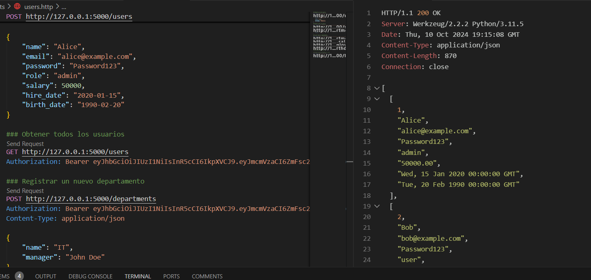
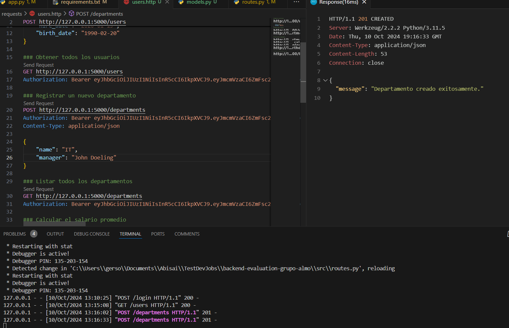
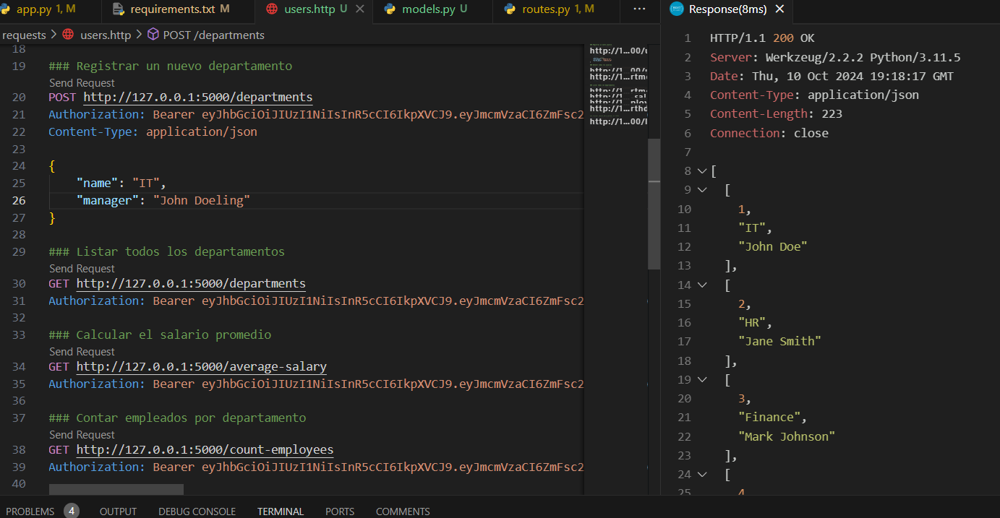
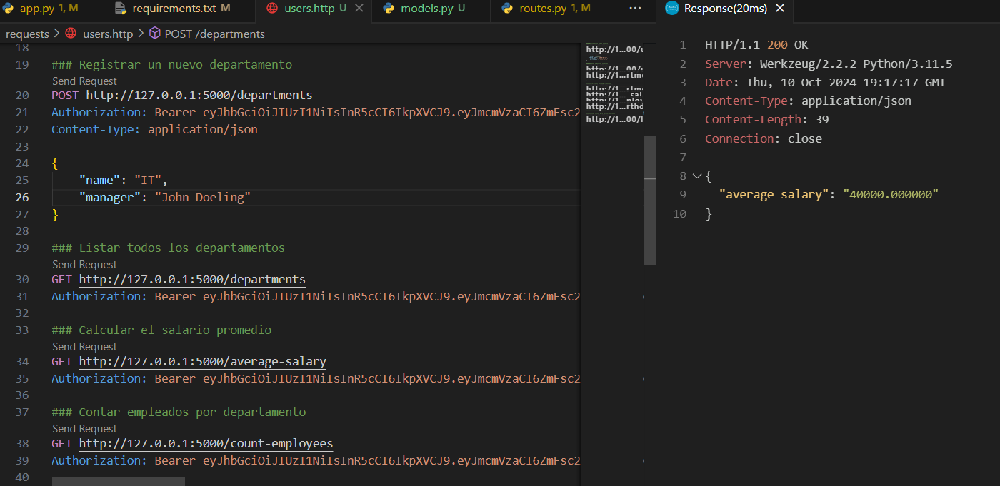
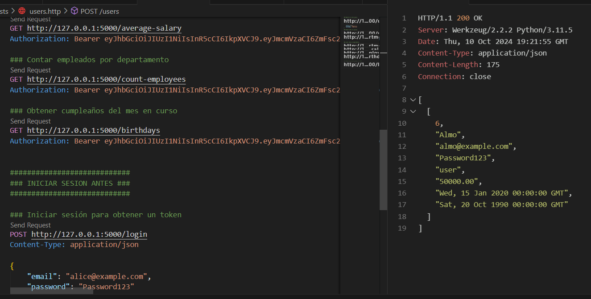

# backend-evaluation-grupo-almo
API RESTful creada como parte de la evaluación técnica para el puesto de Desarrollador Backend en Grupo Almo.  Incluye autenticación JWT, gestión de usuarios y roles, operaciones CRUD, y validaciones.  Tecnologías utilizadas: Python, MySQL.


# Documentación de la API RESTful para la Gestión de Usuarios y Roles

## Tabla de Contenidos
1. [Introducción](#introducción)
2. [Tecnologías Utilizadas](#tecnologías-utilizadas)
3. [Instalación](#instalación)
4. [Configuración de Variables de Entorno](#configuración-de-variables-de-entorno)
5. [Estructura del Proyecto](#estructura-del-proyecto)
6. [Endpoints](#endpoints)
   - [Registro de Usuario](#registro-de-usuario)
   - [Inicio de Sesión](#inicio-de-sesión)
   - [Obtener Usuarios](#obtener-usuarios)
   - [Registrar Departamento](#registrar-departamento)
   - [Listar Departamentos](#listar-departamentos)
   - [Registrar Proyecto](#registrar-proyecto)
   - [Calcular Salario Promedio](#calcular-salario-promedio)
   - [Contar Empleados por Departamento](#contar-empleados-por-departamento)
   - [Obtener Cumpleaños del Mes](#obtener-cumpleaños-del-mes)
7. [Consideraciones Finales](#consideraciones-finales)

## Introducción
Esta API RESTful permite la gestión de usuarios y roles, así como la administración de departamentos y proyectos. Se utiliza para aplicaciones donde es necesario manejar información sobre empleados y sus roles dentro de una organización.

## Tecnologías Utilizadas
- **Flask**: Microframework para Python utilizado para desarrollar la API.
- **Flask-JWT-Extended**: Para manejar la autenticación mediante JSON Web Tokens (JWT).
- **MySQL**: Sistema de gestión de bases de datos utilizado para almacenar información.
- **python-dotenv**: Para manejar las variables de entorno.

## Instalación
1. Clona el repositorio:
   ```bash
   git clone <url_del_repositorio>
   cd backend-evaluation-grupo-almo
   ```

2. Crea un entorno virtual:
    ```bash
   python -m venv venv
   ```

3. Activa el entorno virtual:
    ```bash
    venv\Scripts\activate
    ```
4. Instala las dependencias:
    ```bash
    pip install -r requirements.txt
    ```
5. Iniciar la api
    ```python
    python app.py
    ```

## Configuración de Variables de Entorno

Crea un archivo .env en la raíz del proyecto con el siguiente contenido:

```bash
DB_HOST=localhost
DB_USER=tu_usuario
DB_PASSWORD=tu_contraseña
DB_NAME=tu_basedatos
```

## Estructura del Proyecto

```css
backend-evaluation-grupo-almo/
│
├── src/                      
│   ├── app.py                
│   ├── auth.py               
│   ├── db.py                 
│   ├── models.py             
│   ├── routes.py                
│   └── validations.py             
│
├── requirements.txt          
├── README.md                 
├── RESPUESTAS.md             
└── .gitignore                
```

### Tablas de la base de datos

```sql
    CREATE DATABASE db_grupoAlmo;

    USE db_grupoAlmo;

    CREATE TABLE departments (
        id INT AUTO_INCREMENT PRIMARY KEY,
        name VARCHAR(100) NOT NULL,
        manager VARCHAR(100) NOT NULL
    );

    CREATE TABLE projects (
        id INT AUTO_INCREMENT PRIMARY KEY,
        name VARCHAR(100) NOT NULL,
        start_date DATE,
        end_date DATE,
        department_id INT,
        FOREIGN KEY (department_id) REFERENCES departments(id)
    );

    CREATE TABLE users (
        id INT AUTO_INCREMENT PRIMARY KEY,
        name VARCHAR(100),
        email VARCHAR(100) UNIQUE,
        password VARCHAR(100),
        role ENUM('admin', 'user'),
        salary DECIMAL(10,2),
        hire_date DATE,
        birth_date DATE
    );
```

## Endpoints

### Inicio de Sesión



### Obtener Usuarios



### Registrar Departamento



### Listar Departamentos



### Calcular Salario Promedio



### Cumpleaños del mes



## Consideraciones Finales

### Seguridad:

Uso de HTTPS: Para ambientes de producción, siempre debes implementar HTTPS para proteger los datos transmitidos entre el cliente y el servidor.
Protección del JWT: Asegúrate de que los tokens JWT sean manejados de manera segura. Nunca los guardes en almacenamiento local del lado del cliente sin protección adecuada.

### Gestión de errores:

Implementa un manejo robusto de errores para asegurarte de que los usuarios reciban mensajes significativos y no mensajes de error que revelen información interna del sistema.

### Pruebas:

Implementa pruebas unitarias y de integración para asegurar que los endpoints de la API funcionen correctamente y se comporten como se espera en diferentes escenarios.
Considera herramientas como pytest para pruebas unitarias en Python.